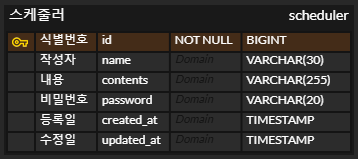

# 📌 Scheduler 과제 📌
#### 3 Layer 아키텍처 형식을 지키면서 CRUD과정을 구현하는 일정관리 앱 서버 만들기 

#### 기간 : 2025. 3. 17  ~ 2025. 03. 26

#### 개발 인원 : 1명

## 프로젝트 구조
```plaintext
└─src
├─main
│  ├─java
│  │  └─org
│  │      └─example
│  │          └─schedulerproject
│  │              │  SchedulerProjectApplication.java
│  │              │
│  │              ├─controller
│  │              │      ScheduleController.java
│  │              │
│  │              ├─dto
│  │              │      ScRequestDto.java
│  │              │      ScResponseDto.java
│  │              │
│  │              ├─entity
│  │              │      Scheduler.java
│  │              │
│  │              ├─repository
│  │              │      JdbcTemplateSchedulerRepositoryImpl.java
│  │              │      SchedulerRepository.java
│  │              └─service
│  │                      SchedulerService.java
│  │                      SchedulerServiceImpl.java
│  │
│  └─resources
│      │  application.properties
│      ├─static
│      └─templates
└─test
└─java
└─org
└─example
    SchedulerProjectApplicationTests.java
```

## 필수
### Lv 0. API 명세 및 ERD 작성

#### ※ 일정 관리 API 명세서

<a href="https://workable-hacksaw-44c.notion.site/1becef54a35680bc87b3d382bc9df4b1?v=1becef54a35680c694ef000c57e5bd3b">일정 관리 API 명세서</a>

#### ※ ERD



- [ ] ERD CLOUD 사이트 에서 구성함.

#### ※ SQL 작성

```sql
CREATE TABLE `scheduler` (
     `id` BIGINT AUTO_INCREMENT PRIMARY KEY NOT NULL,
     `name`	VARCHAR(20)	NULL,
     `contents`	VARCHAR(255)	NULL,
     `password`	VARCHAR(20)	NULL,
     `created_at` TIMESTAMP DEFAULT CURRENT_TIMESTAMP NULL,
     `updated_at` TIMESTAMP DEFAULT CURRENT_TIMESTAMP NULL
);
```

### **Lv 1. 일정 생성 및 조회**

#### 1️⃣ 일정 생성
- [ ]  `할일`, `작성자명`, `비밀번호`, `작성/수정일`을 저장
- [ ]  `작성/수정일`은 날짜와 시간을 모두 포함한 형태

#### 2️⃣ 전체 일정 조회
- 조건 중 한 가지만을 충족하거나, 둘 다 충족을 하지 않을 수도, 두 가지를 모두 충족할 수도 있습니다.
  - [ ]  `수정일` (형식 : YYYY-MM-DD)
  - [ ]  `작성자명`
- [ ] 수정일 기준 내림차순으로 정렬하여 조회
#### 3️⃣ 선택 일정 조회
- [ ]  선택한 일정 단건의 정보를 조회
- [ ]  일정의 고유 식별자(ID)를 사용하여 조회

### **Lv 2. 일정 수정 및 삭제**

#### 4️⃣ 일정 수정
- [ ]  선택한 일정 내용 중 `할일`, `작성자명` 만 수정 가능
    - [ ]  서버에 일정 수정을 요청할 때 `비밀번호`를 함께 전달합니다.
    - [ ]  `작성일` 은 변경할 수 없으며, `수정일` 은 수정 완료 시, 수정한 시점으로 변경합니다.

#### 5️⃣ 일정 삭제
- [ ] 서버에 일정 수정을 요청할 때 비밀번호를 함께 전달합니다.


## 📝 개선 사항
